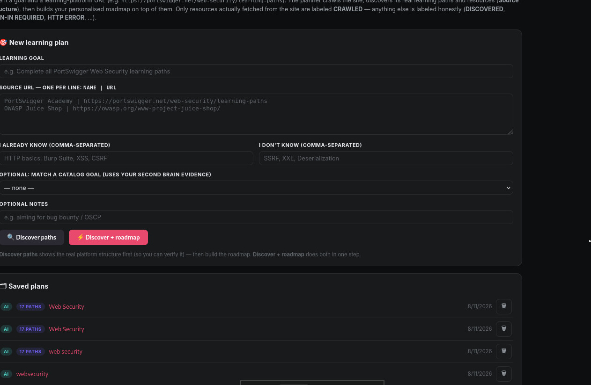
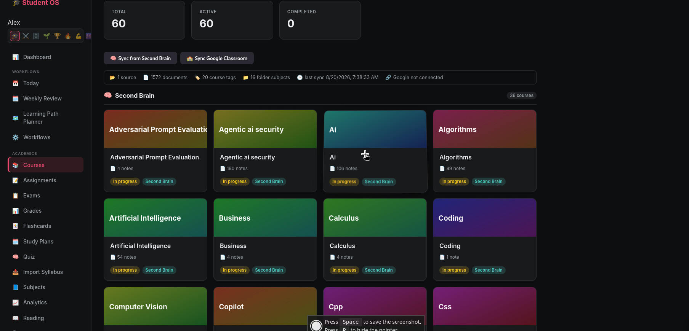
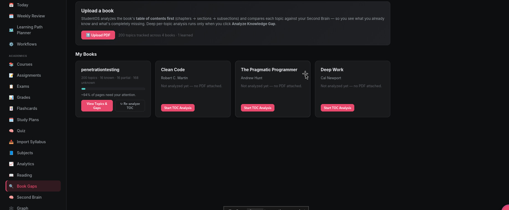
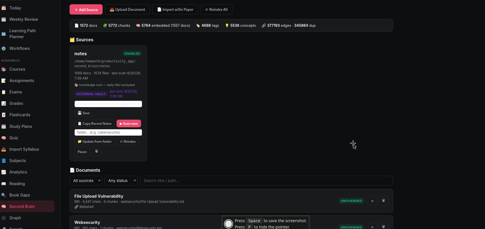
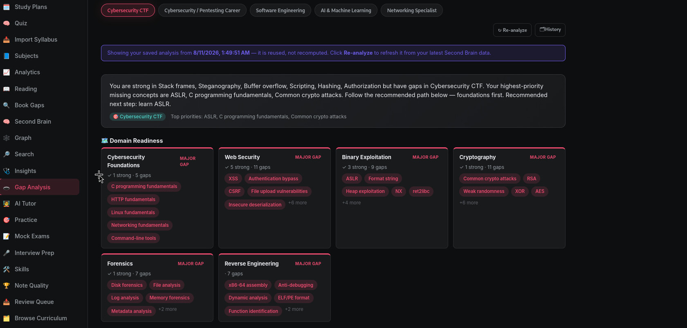

# Student Life OS (Cortex)

A productivity application that helps students manage their academic and personal life in one place. It pairs a **FastAPI** backend with a **React + TypeScript + Vite** frontend, and includes a local-embeddings "second brain" knowledge system.

## Features

- **Courses & Timetable** — track courses, schedules, and academic calendars.
- **Task & Life Management** — tasks, reminders, Eisenhower matrix, daily logs, and goal tracking.
- **Pomodoro Timer** — focus sessions with progress rings and settings.
- **RPG System** — quests, missions, and rewards to gamify productivity.
- **Second Brain / Vault** — local embeddings (fastembed, offline) for semantic search over notes, plus an Obsidian vault integration.
- **Visualizations** — radar charts and dashboards for life areas and academic performance.

## Architecture

```
productivity_app/
├── backend/          # FastAPI app (uvicorn :8000)
│   ├── app/
│   │   ├── routers/  # API route modules
│   │   ├── services/ # Business logic (embeddings, search, …)
│   │   ├── models/   # SQLAlchemy models
│   │   └── schemas/  # Pydantic schemas
│   ├── scripts/
│   └── requirements.txt
├── frontend/         # React 19 + TS + Vite (:5173)
├── second_brain/     # Knowledge base / Obsidian vault
├── screenshots/      # UI screenshots (see below)
└── start.sh          # One-command dev startup
```

## Getting Started

```bash
# Install deps and start both servers (backend :8000, frontend :5173)
./start.sh --install

# Or just start (if already installed)
./start.sh
```

Open the app at <http://localhost:5173>. The frontend proxies `/api` to the backend at <http://localhost:8000>.

### Useful flags

```bash
./start.sh --no-reload   # backend without auto-reload
./start.sh --host 0.0.0.0 # expose to the LAN (default is loopback)
./start.sh --no-open     # don't auto-open the browser
```

### Manual setup

```bash
# Backend
cd backend
python -m venv .venv && source .venv/bin/activate
pip install -r requirements.txt
cp ../.env.example .env   # then fill in values
uvicorn app.main:app --reload --port 8000

# Frontend (in a separate terminal)
cd frontend
npm install
npm run dev
```

## Screenshots











## Tech Stack

- **Backend:** FastAPI, SQLAlchemy, Pydantic, fastembed (local ONNX embeddings)
- **Frontend:** React 19, TypeScript, Vite, Vitest
- **Knowledge base:** Local embeddings + Obsidian vault integration

## License

See repository for license details.
